# TamaPoke

[](https://spocky2024.github.io/TamaPoke_MrsSpock/web/)
[](https://makerworld.com/es/models/2937822-tamapoke-a-pokemon-pokeball-tamagotchi)


[](https://github.com/Spocky2024/TamaPoke_MrsSpock/stargazers)

A gen-1/2/3 Pokémon-inspired tamagotchi for the
**Waveshare ESP32-S3-Touch-AMOLED-1.75** (round 466×466 AMOLED, CO5300 driver
over QSPI, CST9217 touch over I2C).

My version of socquique's TamaPoke, designed with a **Tamagotchi-style gameplay** experience in mind.

Languages **English** and **German**.

Flash it in your browser → **[web installer](https://Spocky2024.github.io/TamaPoke_MrsSpock/web/)**

- 386 Pokemon from the first to the third generation 
- the Pokémon goes to sleep at night; you have to turn off the light until 10 p.m.; don't forget it, or things will turn out badly
- if you don't take care of it, it's guaranteed to run away - like a Tamagotchi
- you can collect steps with your Pokémon or send it out alone for 30–60 minutes of random events. You can encounter new Pokémon on your adventures to complete the Pokédex and find Magic Berries
- there are different Stages depending on how full your Pokédex is (Example: Stage 1 Novice)
- Revised Pokédex (tap briefly on a Pokémon in the Pokédex to view its detail; tap and hold on a Pokémon in the Pokédex to mark it as a Favorite (Favorites can hatch from eggs with little luck; up to three favourites), the medals you've won are recorded in the Pokédex for each Pokémon)
- the watch face has been redesigned
- new medals and an increasing amount of time are required to level up
- the device **automatically turns off** after five minutes to conserve battery life (except for pedometer mode = screen off only)
- two devices can connect via Bluetooth
- three endings: 💛 **Farewell**, 💔 **Run-away**, 👋 **Release** --> **new egg**
- no flickering screen and comfortable touch zones

| Clock screens | Clock screens | Clock screens |
|---|---|---|
| 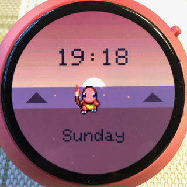 | 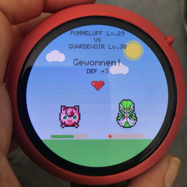 | 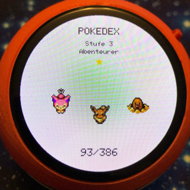 |

| Pedometer Mode | Pokemon Trip | Meet a other Pokemon |
|---|---|---|
|  | 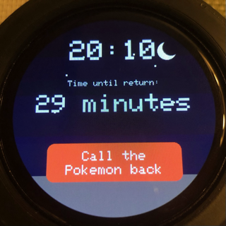 | 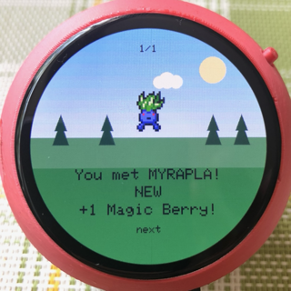 |

| Events | Overview | eat a Magic Berry |
|---|---|---|
|  | 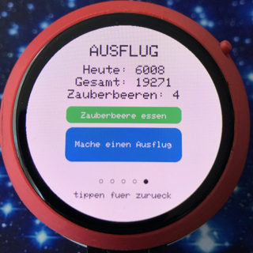 | 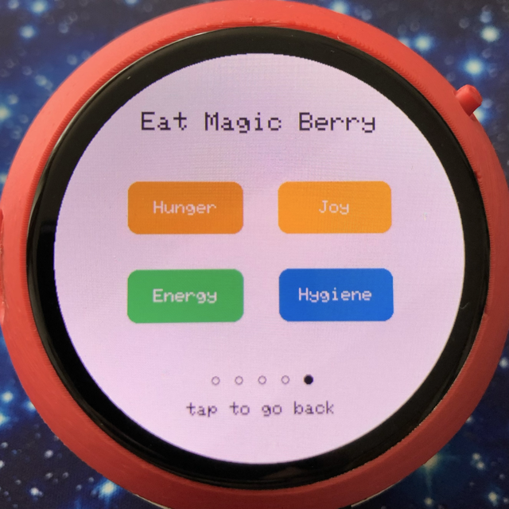 |

| connect two devices | automatic Battle | automatic Battle |
|---|---|---|
| 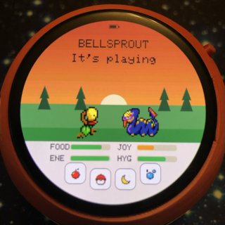 | 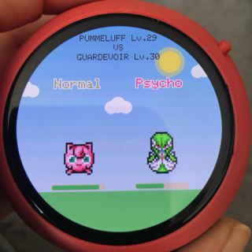 | 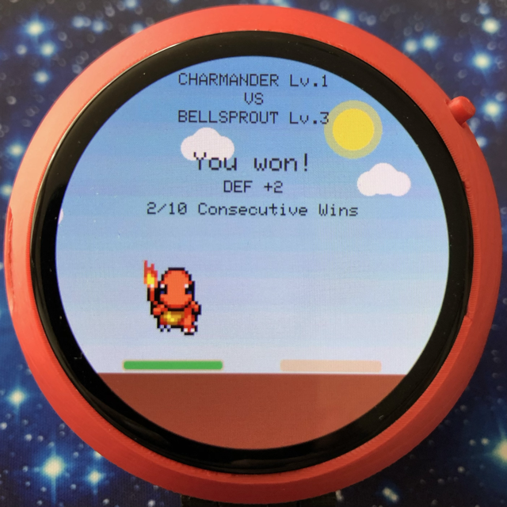 |

| Pokedex Overview & Favorites | Pokedex | Pokemon Medals |
|---|---|---|
|  | 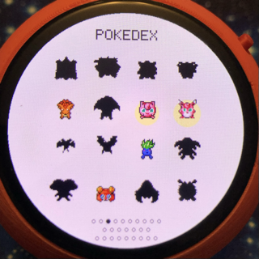 | 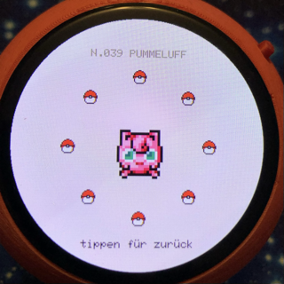 |

| Pokemon Details | turn off Light | have FUN |
|---|---|---|
| 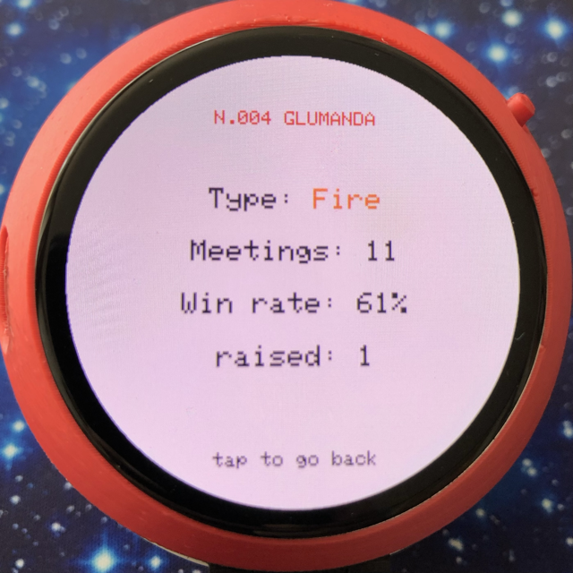 | 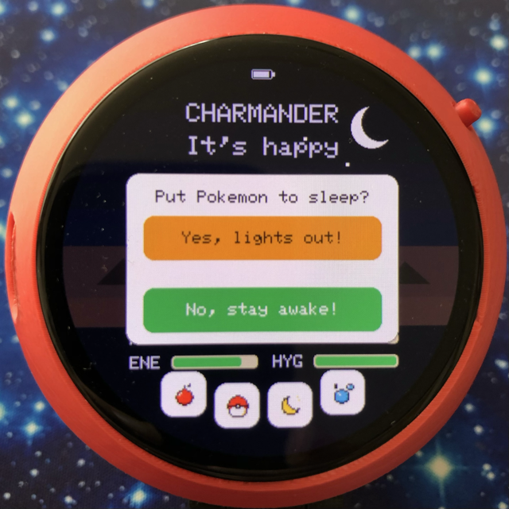 | 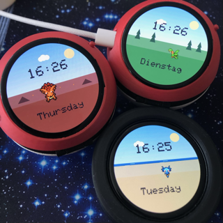 |
  
First start:
- swipe down to the clock screen
- long-tap the clock to set the time und language
- tap OK to save.
- long-tap the day to set the day of the week
- adjustable brightness in clock screen (swipe left or right)

**Read more in the → [PDF Manual](https://github.com/Spocky2024/TamaPoke_MrsSpock/blob/main/TamaPoke_MrsSpock_Manual_5.92.pdf)**
**& [PDF Anleitung](https://github.com/Spocky2024/TamaPoke_MrsSpock/blob/main/TamaPoke_MrsSpock_Spielanleitung_5.92.pdf)**

> **Personal, non-commercial fan project.** Code is MIT; the sprites are from
> PMD SpriteCollab (CC BY-NC, Pokémon © Nintendo/Game Freak), and the 3D case is
> CC BY-NC-SA. See **[License](#license)** and **Credits**.

🔴 **3D-printed Pokéball case + print profiles → [on MakerWorld](https://makerworld.com/es/models/2937822-tamapoke-a-pokemon-pokeball-tamagotchi)** 

## Hardware

- Board: [ESP32-S3-Touch-AMOLED-1.75](https://www.waveshare.com/wiki/ESP32-S3-Touch-AMOLED-1.75)
  — get the **Standard** (no case) or **-G** (GPS, also fits) version; **not the "-B"**
  (ships with a protective case that won't fit with the 3D-printed Pokéball case). The separate "1.75**C**" is a different
- **MicroSD card** (holds the sprite set — any small, class-10 card works)
- 3,7 V lithium battery - JST 1,25

## Libraries (Arduino IDE / arduino-cli)

| Library | Author | Use |
|---|---|---|
| GFX Library for Arduino (`Arduino_GFX`) | moononournation | CO5300 over QSPI + framebuffer in PSRAM |
| SensorLib | Lewis He | CST9217 touch + PCF85063 RTC |
| XPowersLib | Lewis He | AXP2101 PMU (battery, brightness, PWR button) |
| U8g2 | olikraus | CJK glyphs (`unifont_t_japanese3`, the only Japanese subset that also carries `！？。、「」`; `unifont_t_korean2` for Hangul, 2350 syllables against korean1's 478); only the font data is used, not its display driver |
| ESP_I2S (bundled in the ESP32 core) | Espressif | I2S to the ES8311 codec |

## IDE setup / build

- Board: **ESP32S3 Dev Module** · Flash **16MB** · PSRAM **OPI PSRAM**
  (required: the 466×466×16-bit framebuffer ≈ 434 KB lives in PSRAM) ·
  Partition Scheme with FAT (e.g. `16M Flash (3MB APP/9MB FATFS)`) ·
  USB CDC On Boot **Enabled**

```bash
FQBN="esp32:esp32:esp32s3:CDCOnBoot=cdc,FlashSize=16M,PSRAM=opi,PartitionScheme=app3M_fat9M_16MB"
arduino-cli compile --fqbn "$FQBN" .
arduino-cli upload -p /dev/cu.usbmodemXXXX --fqbn "$FQBN" .
```

## Community forks

- **[TamaPoke — Expanded](https://github.com/ShadowEnemyx/TamaPoke/tree/tamapoke-expanded-update)** by **ShadowEnemy** — a substantial community fork (different author/branch): a full **type-matchup battle system**, all **151 + shinies** with a **Pokédex / collection box** and daily goals, **6 UI languages**, **ES8311 sound**, starter choice and a one-click web installer. Worth a look. 🎮
- **[TamaPoke](https://github.com/DylanPDao/TamaPoke)** by **DylanPDao** — another substantial fork: **gym battles** and **LAN battles** between two devices, **movesets**, a **party + box** system, an **EV/IV** stat system, and coverage extended **up to Gen 3 (386)**. Keeps the PMD sprite pipeline. 🏆

## Credits

All sprites: [PMD SpriteCollab](https://github.com/PMDCollab/SpriteCollab)
(community, CC BY-NC). Base stats: [PokéAPI](https://pokeapi.co). Pokémon is a ™ of
Nintendo / Game Freak / The Pokémon Company. Non-commercial, personal-use project.
Full list in [`CREDITS.md`](CREDITS.md).

## License

- **Source code** (firmware + tooling): **[MIT](LICENSE)**.
- **Sprites & names**: © Nintendo / Game Freak / The Pokémon Company; pixel art
  from [PMD SpriteCollab](https://github.com/PMDCollab/SpriteCollab) (CC BY-NC 4.0).
  **Non-commercial use only.**
- **3D-printed case**: remix of *"Pokeball"* by **yoyothechicken**
  ([MakerWorld #839922](https://makerworld.com/es/models/839922-pokeball)),
  licensed **CC BY-NC-SA**, and shared here under the same terms.

This is an unofficial fan project, not affiliated with or endorsed by Nintendo.
